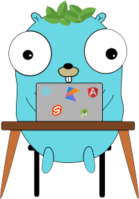

## Hi there, I'm Andrea

I'm a 2nd-year graduate student at the university of applied science in Brugg-Windisch Switzerland, pursuing a Bachelor in Computer Science.

If you ever want to collaborate, do not hesitate to contact me :D.

- 👓 I’m trying to learn Spanish
- ✈ Travelling is my passion
- 🌱 I’m currently learning how to build everything out of microservices.
- 👨‍💻 Software engineer at **[Jacando AG](https://www.jacando.com/en/)**
- 👓 IDE 
- 🛠 I use at work ,,,,
- 🐱‍🏍My favourites are ,,,,
- 🧨I can also use ,,,

